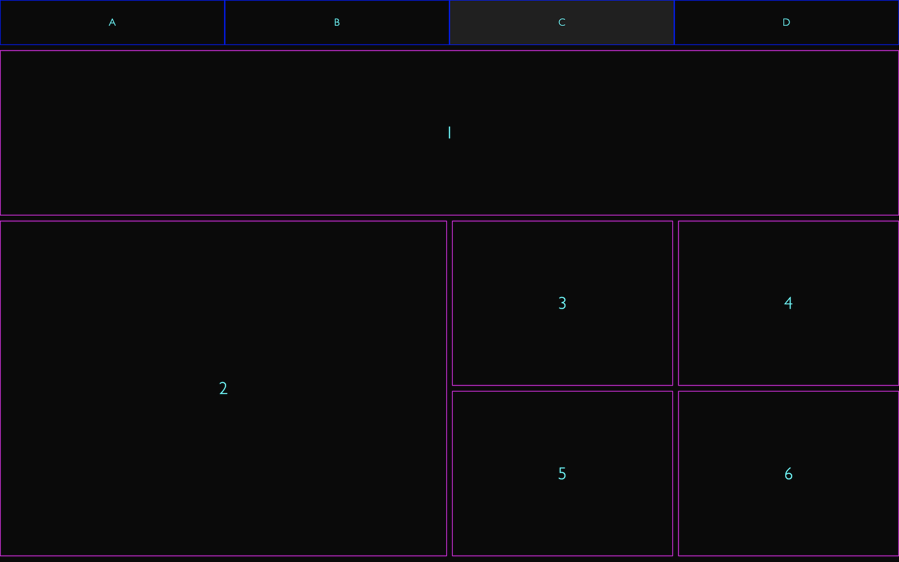

# css-grid-layout-example
Example project demonstrating how to use Grid Layout in CSS

## About
This is an example to demonstrate the concepts and usage of CSS Grid Layout.

Four configurations are provided showing different layouts that can be achieved using Grid Layout.

## Usage
To check it out, open `index.html` in a browser